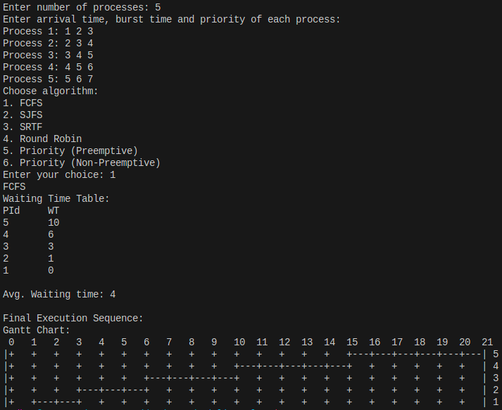

# OS-scheduling-algos
Intuitive CLI tool to visualize process Scheduling algorithms used in an Operating System.

## Install/Download

- Clone the repo and change directory into it

```sh
git clone https://github.com/mdhvg/OS-scheduling-algos.git
cd OS-scheduling-algos
```

- Use any C++ compiler (gcc/clang) to compile the binary

gcc

```sh
g++ Source.cpp -o scheduler
```

clang

```sh
clang++ Source.cpp -o scheduler
```

## Usage

Just run the binary and give the inputs as required

```sh
./scheduler
```

